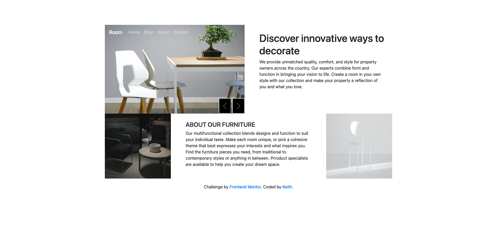

# Frontend Mentor - Room homepage solution

This is a solution to the [Room homepage challenge on Frontend Mentor](https://www.frontendmentor.io/challenges/room-homepage-BtdBY_ENq). Frontend Mentor challenges help you improve your coding skills by building realistic projects. 

## Table of contents

- [Overview](#overview)
  - [The challenge](#the-challenge)
  - [Screenshot](#screenshot)
  - [Links](#links)
- [My process](#my-process)
  - [Built with](#built-with)
  - [What I learned](#what-i-learned)
  - [Continued development](#continued-development)
- [Author](#author)

## Overview

### The challenge

Users should be able to:

- View the optimal layout for the site depending on their device's screen size
- See hover states for all interactive elements on the page
- Navigate the slider using either their mouse/trackpad or keyboard

### Screenshot

### Links

- Solution URL: [https://www.frontendmentor.io/solutions/room-homepage-bootstrap-dwftIRs8H_]
- Live Site URL: [https://keithgaines.github.io/roomhomepage/]

## My process

### Built with

- Semantic HTML5 markup
- CSS custom properties
- Mobile-first workflow
- Bootstrap
- JQuery

### What I learned

During the course of building this project with Bootstrap, jQuery, and custom CSS, I learned a lot about the power and flexibility of these web development tools. Bootstrap's pre-built components and responsive grid system made it easy to create a visually appealing and responsive design quickly. jQuery provided a powerful way to manipulate the DOM and add interactivity to the site, while custom CSS allowed me to fine-tune the styles and make the site truly unique.

Working with these tools also gave me a deeper understanding of front-end web development best practices and standards, such as semantic HTML, responsive design, and mobile-first development. I also gained experience working with version control tools like Git and GitHub, which helped me to organize my code and collaborate with others effectively.

Overall, building this project was a great learning experience that helped me to grow as a front-end developer. I am excited to continue exploring these tools and building more complex and dynamic web applications in the future.

### Continued development

After completing this project, I plan to continue to focus on improving my skills in front-end web development. Specifically, I want to delve deeper into CSS and learn more advanced techniques for creating complex layouts and animations. I also want to learn more about JavaScript frameworks like React and Angular, which can help to simplify the process of building large-scale web applications.

In addition to technical skills, I also want to focus on improving my design skills and learning more about user experience (UX) design. By understanding how users interact with websites and applications, I can create more effective and engaging user interfaces that meet their needs and expectations.

Finally, I plan to continue to focus on best practices and standards in web development, including accessibility, performance optimization, and security. By following these principles, I can create websites and applications that are not only visually appealing and functional, but also efficient, accessible, and secure for all users.

Overall, I am excited to continue to grow and learn as a front-end web developer, and I look forward to applying my skills and knowledge to new projects in the future.

## Author

- Website - [Keith Gaines](https://keithgaines.github.io)
- Frontend Mentor - [@keithgaines](https://www.frontendmentor.io/profile/keithgaines)
